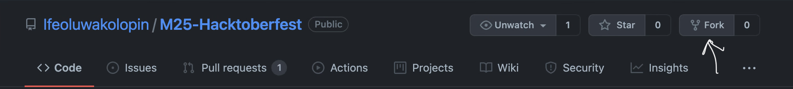
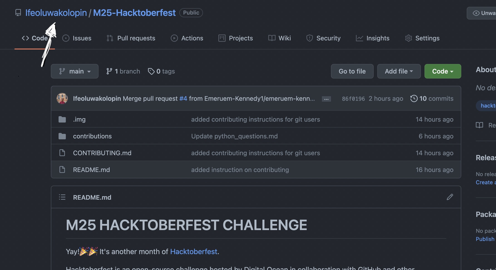
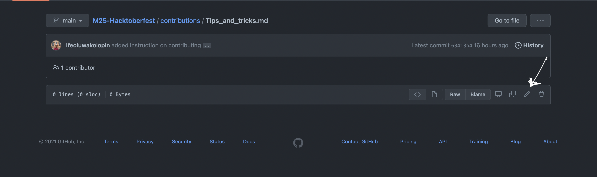

## HOW TO CONTRIBUTE TO THIS REPOSITORY.

**What is in this document?**
* [How to make non-code contributions.](#how-to-make-non-code-contributions)
* [How to make code contributions.](#how-to-make-code-contributions)

To complete hacktoberfest, you need to make a total of **four** pull requests(PRs). Read this section to learn how to make a PR.⬇️
* [**How to make a Pull request**](#how-to-make-a-pull-request)
    * [How to make changes directly from github](#how-to-make-changes-directly-from-github) (This is easier for non-code contributions.)
    * [How to make changes using git and github](#how-to-making-changes-using-git-and-github)
    

### BEFORE YOU CONTINUE READING, FIRST MAKE YOUR OWN COPY OF THIS REPOSITORY.

You can create a fork of this repository by clicking that button.

You should have the repository on your profile as ```YourUsername/M25-Hacktoberfest``` now.

### There are two ways to contribute to this repository.


### How to make non-code contributions
- Navigate into the contributions folder. You should see a file named 'Tips_and_tricks.md'.
You can add a random tip or trick that may be useful for the M25 community and commit it.

- You can also contribute by adding more information to the readme.md or contributing.md file. This could be fixing a grammatical error or typo. (Note: It has to be a significant change though)

- In the contributions folder, we have a file named 'python_questions.md' and a folder called 'answers'.

To participate, you can:
#### Put in a fun question in the python_questions.md file that you'll love other M25s to answer.
* It should be a question that can be solved by writing python code.
* Your question should have a unique number so that it is easy to identify the corresponding solution.

For example: Your question can be called 'question 1' or even question 1043' (just make sure it's a reasonable number)
* It may be a question based on an HC from class or a random algorithm question.


### How to make code contributions
#### Answer a question in the python_questions.md file.
You can also contribute by providing a python solution to any question in the python_questions file.
* **Write your code in a python_file and upload it to the answers folder above**
* Your file name should be prefixed with the question number you are answering.

For example if your code is an answer to 'question 1', then you answer file should be named '1_yourName.py'.
* You should make it well-commented so others can benefit from your code.
* You can answer a question that has already been answered if you provide a diferent solution. In other words, there can be multiple answers to a question.
* Last but not least, make sure your code actually works to solve the problem!

#### Contribute to a project
For folks who want to get more engaged with code, you can contribute code to a side-project. It may be a script, an extension, or any fun project that you want to work on.
Navigate to the projects folder under contributions to see what type of projects you can contribute to.

## How to make a pull request

A [pull request](https://docs.github.com/en/github/collaborating-with-pull-requests/proposing-changes-to-your-work-with-pull-requests/about-pull-requests) is basically a way to let others know that you have made a change to this repository.
* If you have some experience working with git and github, you can follow [these](#how-to-making-changes-using-git-and-github) set of instructions. If otherwise, use [these](#how-to-make-changes-directly-from-github).

#### How to make changes directly from GitHub

* Once you have forked this repository, go to your own copy of this repository on your profile.

This should be your username on your own copy.
* At the top of the folders, you might see a prompt that says, 'This repository is x commits behind Ifeoluwakolopin:main'. If you see such prompt. First click the button to accept changes from the main project before making changes to your copy.

(You might see this prompt if someone has made some changes to the main repository, you have to accept these changes so they can reflect on your own copy of the repository.)
* Next, click on the file you want to contribute to.
* Click on edit


* Make the changes you want to make.
* Save the changs you have made to yourcopy of the repository.
* Go back to the main repository. You should see a green button at the top that says 'compare and pull reqest'.
* Click that to send your pull request.

🎉🎉CONGRATULATIONS, YOU HAVE SUCCESFULLY MADE A PULL REQUEST🎉🎉

Follow these steps to make your pull request.


### How to make changes using Git and GitHub.
- Make sure you have Git on your PC.
You can download it [here](https://git-scm.com/downloads)
- Next, clone your copy of the repository.
- Open a folder on your computer, and type in terminal or git
```
git clone https://github.com/YourUsername/M25-Hacktoberfest.git
```
The link should be the one you copied from your profile.
- Next, set the main repository (this repository) as upstream.
```
git remote add upstream https://github.com/Ifeoluwakolopin/M25-Hacktoberfest.git
```
By adding upstream, you are basically pointing github to the main repository that you are connected to.
- Next, pull from the upstream repository
```
git pull upstream main
```
**NOTE: Since a lot of people are making changes to the repository, it is important to pull from the main repository before you start making any changes.**

By pulling, you are making sure that your repository is up-to-date with the main repository.

- Next, create a new branch where you will make your changes. For consistency, we will name our branch 'develop-yourUserName'

It is important to create a new branch so that your changes will not be conflicting with changes on the main branch. To create a new branch use
```
git checkout -b branchName
```
Like we said, our branch names should be your username joined with an hyphen to the word 'develop'. So:
```
git checkout -b develop-yourUserName
```

- Once you have done this, you should be on a new branch now.
- **You can now make any changes (additions/corrections) to the repository**

### After making changes:
Once you are done with your changes.
- Save all the changes you have made.
- Add your changes by running
```git add .```.
- Next commit your changes to Git.
You can add a message to identify your commit. For example
```git commit -m 'added question1'``` or ```git commit -m 'fixed typo in readme'```
- Once you have committed the changes to your repository. You should push your changes to GitHub.

Run:

```git push origin branchName```
'branchName' should be the name of the branch you just created.
Example: ```git push origin develop-yourUsername```

At this point, you have succesfully made your changes and pushed to GitHub!

One last stage remains! Go to the [main](https://github.com/Ifeoluwakolopin/M25-Hacktoberfest) repository on GitHub.
You should see a green button at the top that says, 'Compare and Pull Request'.

CLick that button to make a Pull Request (PR)!.

🎉🎉CONGRATULATIONS, YOU HAVE SUCCESFULLY MADE A PULL REQUEST🎉🎉

Follow these steps to make your pull request. remember, you need to make four PRs to complete the challenge.

Once your PR has been merged, Check your Hacktoberfest [dashboard](https://hacktoberfest.digitalocean.com/profile), you should see your PR in review.